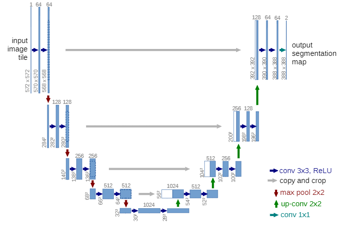
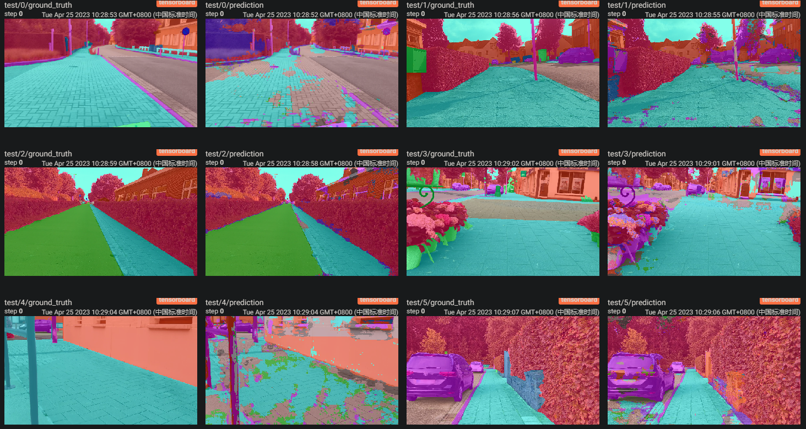

# U-Net

## 简介

本仓库是一个用 PyTorch 实现的 U-Net 语义分割模型（原论文：[U-Net: Convolutional Networks for Biomedical Image Segmentation](https://arxiv.org/abs/1505.04597)），使用的数据集是来自 Hugging Face 社区的[人行道图像语义分割数据集](https://huggingface.co/datasets/segments/sidewalk-semantic)，共有 100张图像和 35 个类别，每张图像分辨率为 $1080\times1920$，使用平均交并比（MIoU）作为分割结果的评价指标。

### 环境

本次实验代码基于 PyTorch 框架，python 版本为 3.9.16，使用到的 Python 模块及版本如下：

```
albumentations  1.3.0
matplotlib      3.7.1
numpy           1.24.2
Pillow          9.4.0
tensorboard     2.12.1
torch           1.13.1
torchvision     0.14.1
tqdm            5.7.1
```

另外，本代码也在 python 3.7.6 和 torch 1.8.1 环境下测试通过。

### 项目结构

```
Code1
├─ data                  // 数据集
├─ main.py               // 启动程序
├─ prepare_data.ipynb    // 构造数据集
├─ run.sh                // 运行脚本
└─ src                   // 源代码
   ├─ datasets.py        // PyTorch 数据集
   ├─ metrics.py         // 评价指标计算
   ├─ tester.py          // 推理和测试
   ├─ trainer.py         // 训练
   ├─ unet.py            // UNet 模型
   └─ visualization.py   // 结果可视化
```

### 运行

如果想要复现最佳实验结果，请执行 `prepare_data.ipynb` 第一个代码单元格以下载完整数据集，并通过以下命令进行训练（Linux 环境下可直接执行 `run.sh`）：

```bash
python main.py \
    --data_path "./data/sidewalk-semantic" \
    --input_size 724 \
    --batch_size 16 \
    --total_steps 4000 \
    --eval_steps 100 \
    --learning_rate 0.0005 \
    --output_path "./output"
```

## 方法

### 数据处理

本实验将数据集中 1000 张图像按 7:1:2 的比例随机划分为训练、验证和测试集，使用的预处理方法为标准化，数据增强方法为随机裁剪和水平翻转。

### 模型

如图 1 所示，本次实验使用的模型为 U-Net，模型架构与原论文完全相同，分为左边的收缩路径和右边的拓展路径。在收缩路径，通过多次的连续卷积和池化压缩特征图；在拓展路径，将转制卷积放大的特征图与来自收缩路径裁剪后的特征图拼接，再经过连续卷积融合特征，如此重复多次，最后通过 $1\times1$ 卷积得到分割结果。



<center><strong>图 1  U-Net 模型架构</strong></center>

### 训练

本次实验训练的总步数为 6000 步，每 100 步进行一次验证并且保存验证集 MIoU 分数最高的权重参数。Batch size 为 16，学习率为 0.0005，使用的优化器为 AdamW，学习率调度策略为 OneCycle。

### 推理

如图 1 所示，注意到 U-Net 的输入图像与输出掩码尺寸并不相同，并且远小于数据集中每张图像的尺寸，所以需要遵照原论文使用 Overlap-tile 策略将原图填充到适当大小，再切分为若干小块进行推理，最后将预测结果拼接成完整的分割图。

## 实验结果及分析

### 输入图像大小

如图 1 所示，按照原始 U-Net 是输入输出大小（572-388），需要先将原图像从 $1080\times1920$ 镜像填充到 $1348\times2124$，再切分成 $3\times5$ 小块，分别进行推理。但是，将图像切分得过小将丢失很多重要全局信息，影响分割效果。因此，我对输入图像大小与分割效果进行了实验探究。为节省时间，这部分实验训练步数为 2000 步。

<center><strong>表 1  输入图像大小对分割效果的影响</strong></center>

| Input Size | Output Size |   Patches   |       MIoU       |
| :--------: | :---------: | :----------: | :--------------: |
|    572    |     388     | $3\times5$ |      0.1546      |
|    668    |     484     | $3\times4$ |      0.1681      |
|    724    |     540     | $2\times4$ | **0.1715** |

如表 1 所示，增加输入图像的大小对于分割效果具有稳定提升，但是增大输入大小的同时也会增加每一个卷积层的特征图大小，从而急剧增加显存的消耗，受设备显存大小限制，无法进一步增大图像大小进行实验。

### 最终结果

最终选用的输入图像大小为 724，训练 6000 步，并与 Hugging Face 社区上其他在此数据集上微调后的模型进行对比：

<center><strong>表 2  实验结果</strong></center>

|                                             模型                                             |  MIoU  |
| :------------------------------------------------------------------------------------------: | :----: |
|         [segformer-b0 (3-Epoch)](https://huggingface.co/nielsr/sidewalk-semantic-demo)         | 0.1135 |
|                                            U-Net                                            | 0.2005 |
| [segformer-b3](https://huggingface.co/segments-tobias/segformer-b3-finetuned-segments-sidewalk) | 0.4345 |
|    [segformer-b4](https://huggingface.co/nickmuchi/segformer-b4-finetuned-segments-sidewalk)    | 0.5168 |

如表 2 所示，U-Net 虽然超过了只微调 3 个 Epoch 的 Segformer-b0，但是相比 Segformer-b3/4 性能上有较大差距，这是因为基于 Transformer 模型对全局特征有更强的提取能力，而且经过了 ImageNet 大量数据的预训练，有更强的提取语义信息的能力。



<center><strong>图 2  测试集部分图像分割结果，每两张图左边为真实标签，右边为预测结果</strong></center>

如图 2 所示，模型对于植物等纹理与其他物体差异比较明显的物体能够很好地分割，但是对于人行道和公路这类纹理相似的物体分割效果较差。
